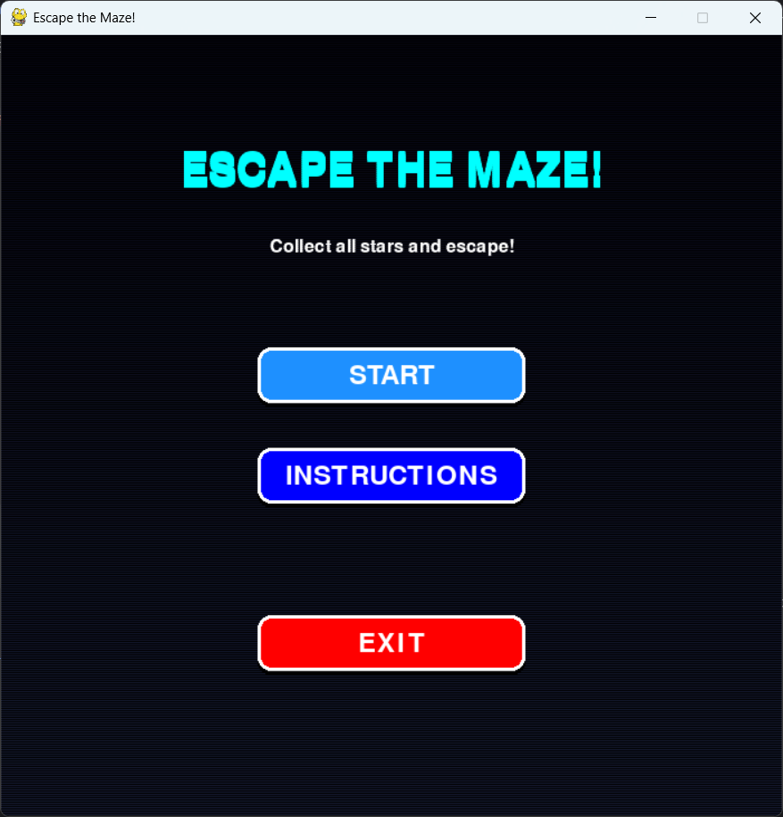
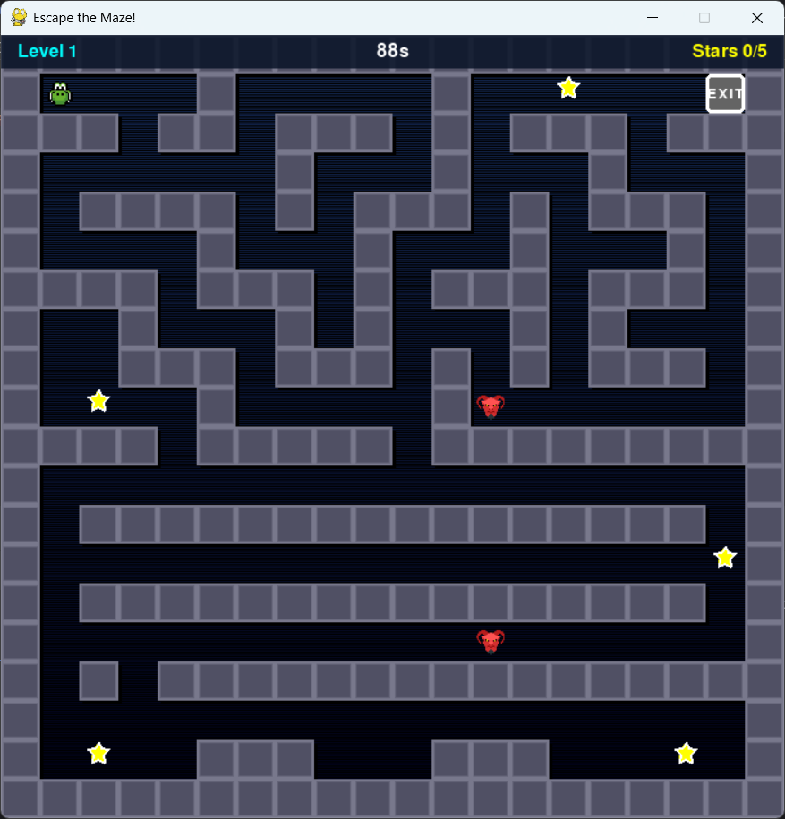

# 🎮 Escape the Maze!

[](https://www.python.org/downloads/)
[](https://www.pygame.org/)
[](LICENSE)
[](https://github.com/aimanazuman/python-escape-the-maze-game)

A 2D grid-based maze game with intelligent AI enemies inspired by classic arcade games like Pac-Man. Navigate through challenging mazes, collect stars, avoid enemies, and escape before time runs out!

**🎓 Academic Project:** SWC3643 - Python Programming Language




---

## 🌟 Features

### ✨ Core Gameplay
- **5 Progressive Levels** - Increasing difficulty with more enemies and complex maze layouts
- **Grid-Based Movement** - Smooth tile-by-tile movement system inspired by Tomb of the Mask
- **Intelligent Enemy AI** - Pac-Man style ghost behavior with three states (patrol, chase, return)
- **Puzzle Mechanics** - Collect all stars to unlock the exit
- **Time Challenge** - Beat each level before the countdown reaches zero
- **Complete Game Progression** - Win/lose screens, level transitions, and victory celebration

### 🤖 Advanced AI System
- **Distance-Based Detection** - Enemies spot player within detection radius
- **Smart Pathfinding** - Navigate around obstacles to reach player
- **State Machine** - Patrol → Chase → Return behavior patterns
- **Anti-Stuck Logic** - Multiple fallback strategies prevent freezing

### 🎨 Visual & Audio
- **Gradient Backgrounds** - Dynamic color schemes for different game states
- **3D-Style Walls** - Depth effects with shadows and highlights
- **Glowing Exit** - Visual feedback when exit unlocks
- **Background Music** - Looping soundtrack with volume control
- **Sound Effects** - Collection, victory, and defeat sounds
- **Graceful Degradation** - Works without assets using geometric shapes

### 🎯 Game Features
- **Main Menu** - Start, Instructions, Exit options
- **Pause System** - ESC to pause, resume gameplay
- **Quick Restart** - Press R to restart current level
- **Scoring System** - Points for collecting items and time bonuses
- **HUD Display** - Real-time level info, timer, and collection progress
- **Complete Victory Screen** - Celebrate finishing all levels

---

## 📋 Table of Contents

- [Installation](#-installation)
- [How to Play](#-how-to-play)
- [Game Controls](#-game-controls)
- [Project Structure](#-project-structure)
- [Game Mechanics](#-game-mechanics)
- [Technical Details](#-technical-details)
- [Development](#-development)
- [Customization](#-customization)
- [Troubleshooting](#-troubleshooting)
- [Credits](#-credits)

---

## 🚀 Installation

### Prerequisites

- **Python 3.7 or higher**
- **Pygame 2.0 or higher**

### Step 1: Clone Repository

```bash
git clone https://github.com/aimanazuman/escape-the-maze.git
cd escape-the-maze
```

### Step 2: Install Dependencies

```bash
pip install pygame
```

### Step 3: Run the Game

```bash
python main.py
```

---

## 🎮 How to Play

### Objective

Navigate through increasingly difficult mazes by collecting all stars (⭐) and reaching the exit (🟢) before time runs out!

### Gameplay Loop

1. **Start Level** - Player spawns at the starting position (green circle)
2. **Collect Stars** - Gather all yellow floating stars in the maze
3. **Avoid Enemies** - Red enemies patrol and chase when they spot you
4. **Unlock Exit** - Once all stars are collected, the exit turns green
5. **Escape** - Reach the exit before the timer expires
6. **Progress** - Complete all 5 levels to win the game

### Enemy Behavior

- **Patrol Mode** (Dark Red) - Random wandering when player is far
- **Chase Mode** (Bright Red) - Actively hunts player when detected
- **Return Mode** (Pink) - Returns to starting position after losing player

Enemies detect you within ~7 tiles and will chase for 4 seconds even after losing sight!

---

## 🕹️ Game Controls

| Key | Action |
|-----|--------|
| **↑** or **W** | Move Up |
| **↓** or **S** | Move Down |
| **←** or **A** | Move Left |
| **→** or **D** | Move Right |
| **ESC** | Pause/Unpause |
| **R** | Restart Level |
| **Mouse Click** | Navigate menus |

### Tips & Tricks

- 💡 **Plan Your Route** - Movement is grid-based, think ahead
- ⏱️ **Manage Time** - Balance speed with safety
- 🧠 **Learn Patterns** - Enemies have predictable patrol routes
- 🏃 **Strategic Retreats** - Sometimes running away is smarter than confrontation

---

## 📁 Project Structure

```
escape-the-maze/
│
├── main.py                 # Game entry point
├── constants.py            # Configuration (colors sizes, levels)
├── game_manager.py         # Game state controller
├── maze.py                 # Level manager
├── player.py               # Player character logic
├── enemy.py                # Enemy AI system
├── collectible.py          # Collectible items
├── ui.py                   # User interface
├── audio_manager.py        # Sound system
│
├── assets/                 # Game assets (optional)
│   ├── images/
│   │   ├── player.png      # 30x30 player sprite
│   │   ├── enemy.png       # 30x30 enemy sprite
│   │   └── collectible.png # 20x20 star sprite
│   └── sounds/
│       ├── background.mp3  # Background music
│       ├── collect.wav     # Collection sound
│       ├── win.wav         # Victory sound
│       └── lose.wav        # Defeat sound
│
├── README.md              # This file
└── LICENSE                # MIT License
```

---

## 🎯 Game Mechanics

### Grid-Based Movement

- Player moves **one tile at a time**
- Smooth interpolation between tiles for visual polish
- Collision detection prevents wall clipping
- Movement speed: 5 pixels/frame (PLAYER_SPEED constant)

### Enemy AI System

The enemy AI uses a sophisticated state machine with multiple fallback strategies:

```python
States:
├── PATROL: Random wandering
│   ├── Avoids immediate reversals
│   └── Changes direction when blocked
│
├── CHASE: Pursues player
│   ├── Triggered by distance < 280 pixels
│   ├── Navigates to last known position
│   ├── Uses multi-layered pathfinding
│   └── Persists for 4 seconds after losing sight
│
└── RETURN: Goes back to spawn
    ├── After chase timeout
    └── Resumes patrol when home
```

**Pathfinding Logic:**
1. Try primary direction (toward target)
2. Try perpendicular direction
3. Try any available direction (avoid reverse)
4. Last resort: allow reverse movement

### Collectible System

- **Floating Animation** - Stars bob up and down
- **Collection Radius** - Player must touch star to collect
- **Exit Lock** - Exit remains gray until all stars collected
- **Visual Feedback** - Exit glows green when unlocked

### Timer System

- **Level-Specific Times:**
  - Level 1: 90 seconds
  - Level 2: 100 seconds
  - Level 3: 110 seconds
  - Level 4: 120 seconds
  - Level 5: 150 seconds
- **Warning:** Timer turns red with <10 seconds remaining
- **Time Bonus:** +10 points per second remaining

### Scoring System

| Action | Points |
|--------|--------|
| Collect Star | +100 |
| Complete Level | +500 |
| Time Bonus | +10/second |

**Example:** Complete Level 1 with 23 seconds left = 100×2 + 500 + 230 = **930 points**

---

## 🔧 Technical Details

### Architecture

**Design Pattern:** Entity-Component-System (ECS) inspired
- **Entities:** Player, Enemy, Collectible
- **Systems:** Movement, Collision, Rendering, Audio
- **Manager:** GameManager orchestrates everything

### Key Technologies

- **Python 3.7+** - Core language
- **Pygame 2.0+** - Game framework
- **Object-Oriented Design** - Clean, maintainable code
- **State Machines** - For game states and AI
- **Grid System** - 20×17 tiles (800×700 resolution)

### Performance

- **Target:** 60 FPS
- **Grid Size:** 40×40 pixels per tile
- **Screen Resolution:** 800×700 pixels
- **Memory Usage:** ~50MB (with assets loaded)

### Code Quality

- ✅ Modular design (9 Python files)
- ✅ Comprehensive documentation
- ✅ Clear naming conventions
- ✅ Error handling with fallbacks
- ✅ No code duplication
- ✅ Single Responsibility Principle

---

## 💻 Development

### Running in Development Mode

```bash
# Standard run
python main.py

# With debug output (add to constants.py)
DEBUG = True
```

### Adding Custom Levels

Edit `constants.py` and add a new maze layout:

```python
CUSTOM_LEVEL = [
    [1,1,1,1,1,1,1,1,1,1,1,1,1,1,1,1,1,1,1,1],
    [1,2,0,0,0,0,0,0,0,0,0,0,0,0,0,0,0,0,3,1],
    # ... more rows
    [1,1,1,1,1,1,1,1,1,1,1,1,1,1,1,1,1,1,1,1],
]

# Legend:
# 0 = empty space
# 1 = wall
# 2 = player start
# 3 = exit
# 4 = enemy
# 5 = collectible

# Add to LEVELS list
LEVELS.append({
    "maze": CUSTOM_LEVEL,
    "time": 120,
    "name": "Custom Level"
})
```

### Testing

```bash
# Test individual components
python -c "from player import Player; p = Player(5,5); print('Player OK')"
python -c "from enemy import Enemy; e = Enemy(10,10); print('Enemy OK')"
```

---

## ⚙️ Customization

### Difficulty Adjustment

Edit `constants.py`:

```python
# Make game easier
PLAYER_SPEED = 8              # Faster player (default: 6)
ENEMY_SPEED = 2.0             # Slower enemies (default: 2.5)
ENEMY_CHASE_DISTANCE = 200    # Shorter detection (default: 280)
LEVEL_1_TIME = 120            # More time (default: 90)

# Make game harder
PLAYER_SPEED = 4              # Slower player
ENEMY_SPEED = 3.0             # Faster enemies
ENEMY_CHASE_DISTANCE = 350    # Longer detection
LEVEL_1_TIME = 60             # Less time
```

### Visual Customization

```python
# Change colors (constants.py)
PLAYER_COLOR = (0, 255, 255)  # Cyan (default)
ENEMY_COLOR = (255, 0, 0)     # Red (default)
COLLECTIBLE_COLOR = (255, 255, 0)  # Yellow (default)

# Adjust sizes
PLAYER_SIZE = 35              # Bigger player (default: 30)
ENEMY_SIZE = 35               # Bigger enemies (default: 30)
TILE_SIZE = 50                # Larger tiles (default: 40)
```

### Audio Settings

```python
# In game_manager.py
pygame.mixer.music.set_volume(0.50)  # Louder music (default: 0.30)

# In audio_manager.py
self.sounds["collect"].set_volume(0.8)  # Louder collection sound
```

---

## 🐛 Troubleshooting

### Game Won't Start

**Issue:** `ModuleNotFoundError: No module named 'pygame'`

**Solution:**
```bash
pip install pygame
# or
pip3 install pygame
```

---

### Audio Not Playing

**Issue:** No sound or music

**Solution:**
1. Check if asset files exist in `assets/sounds/`
2. Game works without audio (graceful degradation)
3. Verify pygame mixer initialized:
```python
import pygame
pygame.mixer.init()
print(pygame.mixer.get_init())  # Should print sample rate
```

---

### Enemies Freezing

**Issue:** Enemies stop moving

**Solution:**
- Ensure you're using the latest `enemy.py` code
- Enemy has anti-stuck mechanisms built-in
- If persistent, check console for errors

---

### Performance Issues

**Issue:** Game runs slowly (<60 FPS)

**Solution:**
```python
# Reduce FPS requirement (constants.py)
FPS = 30  # Lower target

# Disable background gradient (maze.py)
# Comment out gradient drawing code in Maze.draw()
```

---

### Screen Size Issues

**Issue:** Game window too large/small

**Solution:**
```python
# Edit constants.py
SCREEN_WIDTH = 800   # Adjust width
SCREEN_HEIGHT = 700  # Adjust height
```

---

## 🎓 Educational Value

### Learning Outcomes

This project demonstrates:

✅ **Object-Oriented Programming**
- Classes and objects
- Inheritance and composition
- Encapsulation and abstraction
- Polymorphism

✅ **Game Development**
- Game loops and frame rate control
- Event handling
- Collision detection
- State machines
- AI pathfinding

✅ **Python Skills**
- Module organization
- Error handling
- File I/O
- Collections and data structures

✅ **Software Engineering**
- Code organization
- Documentation
- Version control
- Testing strategies

---

## 📄 License

This project is licensed under the MIT License - see the [LICENSE](LICENSE) file for details.

---

## 🙏 Credits

### Development
- **Developer:** Aiman Azman
- **Course:** SWC3643 - Python Programming Language
- **Institution:** Universiti Poly Tech Malaysia
- **Academic Year:** 2025

### Inspiration
- **Pac-Man** (Namco, 1980) - Enemy AI behavior
- **Tomb of the Mask** (Playgendary, 2016) - Grid movement mechanics

### Technologies
- [Python](https://www.python.org/) - Programming language
- [Pygame](https://www.pygame.org/) - Game development framework

### Resources
- Pygame Documentation
- Python Official Documentation
- Game AI Pro (Steve Rabin)

---

## 🤝 Contributing

This is an academic project, but suggestions and improvements are welcome!

### How to Contribute

1. Fork the repository
2. Create a feature branch (`git checkout -b feature/AmazingFeature`)
3. Commit changes (`git commit -m 'Add some AmazingFeature'`)
4. Push to branch (`git push origin feature/AmazingFeature`)
5. Open a Pull Request

### Ideas for Contributions

- [ ] Additional level designs
- [ ] New power-up types
- [ ] Different enemy AI behaviors
- [ ] Level editor tool
- [ ] Multiplayer support
- [ ] Achievement system
- [ ] High score leaderboard
- [ ] Mobile port

---

## 📞 Contact

**Project Link:** [https://github.com/yourusername/escape-the-maze](https://github.com/aimanazuman/python-escape-the-maze-game)

**Issues:** [https://github.com/yourusername/escape-the-maze/issues](https://github.com/aimanazuman/python-escape-the-maze-game/issues)

**Email:** contact.aiman.azman@gmail.com

---

## 🎉 Acknowledgments

Special thanks to:
- **Madam Norhasiah** - Course instructor and project supervisor
- **UPTM** - University Teknologi MARA for resources and support
- **Pygame Community** - Excellent documentation and tutorials
- **Playtesters** - Friends and classmates who provided feedback

---

## 📊 Project Stats


**Development Time:** 3 Days  
**Lines of Code:** ~2,000  
**Number of Classes:** 8  
**Levels:** 5  
**Enemy AI States:** 3  

---

<div align="center">

**⭐ If you found this project helpful, please give it a star! ⭐**

Made with ❤️ and lots of ☕ by Aiman

[⬆ Back to Top](#-escape-the-maze)

</div>
